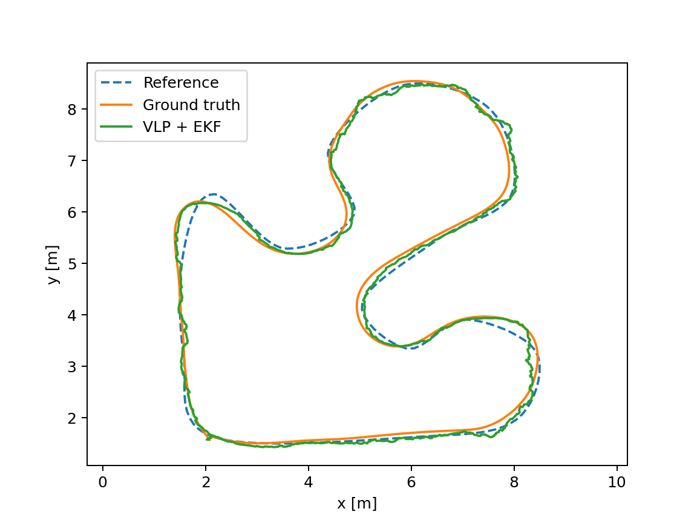

# VLP-EKF Navigation for Pioneer 3-DX

[](http://wiki.ros.org/noetic)
[](https://www.python.org/)
[](http://gazebosim.org/)
[](https://www.radiance-online.org/)
[](LICENSES.md)

Indoor localization and navigation stack for a **Pioneer 3-DX (P3DX)** mobile
robot in ROS Noetic / Gazebo, combining **Visible Light Positioning (VLP)**,
an **ANN-based pose estimator**, **wheel odometry**, **EKF sensor fusion**
(`robot_localization`), and a **Pure Pursuit** path-tracking controller.

---

## Project Status

**Closed-loop VLP/EKF-based navigation was demonstrated in simulation.**
Experiment C used `/odometry/filtered` to control the P3DX along the Interlagos
circuit. Three runs passed the predefined integrity and physical-completion
criteria and form the aggregate below. One additional complete lap in the final
10 Hz configuration was rejected because of a 3.3 s ANN data gap.

| Experiment | Scope | Evidence |
|---|---|---|
| A | Pure Pursuit using Gazebo ground truth | Historical straight-path and circuit baseline |
| B | VLP+EKF localization under manual teleoperation | Historical localization-only measurements |
| C | Closed-loop Pure Pursuit using VLP+EKF | Three accepted runs, with per-run metrics, provenance and plots |

Results are simulation-only; no physical-hardware validation is claimed.

## System Overview

```text
Gazebo / ground truth
    +--> VLP/Radiance sensor simulator: synthesize illuminance measurements
    +--> Offline evaluation and experimental safety observer
    X    No direct pose input to EKF or Pure Pursuit

Radiance/VLP --> ANN --> /ann_pose (x/y) --> EKF <-- /RosAria/odom_ (vx, wz)
                                             |
                                    /odometry/filtered
                                             |
                                        Pure Pursuit <-- /navigation/test_path
                                             |
                                     /RosAria/cmd_vel
                                             |
                                         Gazebo P3DX
```

Ground truth represents the physical simulated state needed to synthesize the
optical sensor measurement. The estimator/controller receives only derived VLP
measurements and wheel odometry: there is no ground-truth pose fallback or
continuous ground-truth correction of position or heading.

ANN supplies x/y, **not absolute yaw**; its identity quaternion is not a heading
measurement. The EKF uses the known spawn yaw as a fixed initial condition;
subsequent heading propagation uses wheel angular velocity. VLP position updates
can affect the fused state through EKF correlations, but provide no independent
yaw observation. All accepted runs used the same fixed spawn prior:
x=2.136593 m, y=1.633511 m, yaw=-0.278154 rad.

The Experiment C launch sets `base_link_frame=base_link_d` and EKF frequency to
10 Hz, matching wheel odometry/TF. The EKF publishes `map → odom`; simulation
publishes `odom → base_link_d`. No artificial static transform was added.
`fake_localization` is disabled for this experiment. Other launch defaults are
preserved; DWA, move_base, teleop and physical drivers are not started by it.

---

## Subsystems

### 1. Visible Light Positioning (`ros_ws/src/vlp`)

`vlp/scripts/vlp.py` simulates the physical VLC channel using
[Radiance](https://www.radiance-online.org/) (`ies2rad`, `oconv`, `rtrace`,
`genbox`, `xform`):

- each of the 12 luminaires is described by a real IES photometric file
  (`estimator/IES_files/LEDtube.ies`) and placed in the room;
- each luminaire is modulated at its own frequency (4.75–46.25 kHz range);
- at every simulation step, `rtrace` computes the instantaneous illuminance
  at the robot's position for each luminaire, the signal is windowed
  (10 ms) and sampled at 100 kHz;
- `estimator/fft.py` applies an FFT and extracts the RMS amplitude at each
  of the 12 modulation frequencies, producing a 12-dimensional feature
  vector (`custom_msg_python/msg/IlluminanceArray`).

### 2. ANN Pose Estimator (`ros_ws/src/vlp/scripts/ann.py`)

A small MLP regressor (PyTorch, `input_dim=12 → hidden=128 → output=2`)
maps the 12-dimensional illuminance feature vector to a planar `(x, y)`
position estimate, published as `/ann_pose`
(`geometry_msgs/PoseWithCovarianceStamped`). Trained weights are included in
`vlp/scripts/models/model_RNA.pickle`.

> **[EVIDENCE NEEDED]** The training procedure, dataset generation script,
> train/validation split, and standalone estimator accuracy (i.e. ANN error
> before EKF fusion) are not yet documented in this repository. Add these
> before citing the ANN's accuracy independently of the fused result below.

### 3. EKF Sensor Fusion (`ros_ws/src/nav`)

Uses the standard ROS `robot_localization` package
(`nav/config/ekf.yaml`), fusing:

- **odometry velocity** (`/RosAria/odom_`: linear x, angular z only);
- **ANN/VLP position** (`/ann_pose`: x, y only).

Output in Experiment C: `/odometry/filtered`, `map → base_link_d` in 2D mode.
The experiment overrides the shared YAML base frame and frequency in its launch.

### 4. Pure Pursuit Controller (`ros_ws/src/pure_pursuit`)

Independent, previously-validated geometric path-tracking controller. See
[`ros_ws/src/pure_pursuit/README.md`](ros_ws/src/pure_pursuit/README.md) for
the full technical description, interfaces, fail-safe behavior, and its own
experimental results against 
Gazebo ground truth.

### 5. Simulation World (`ros_ws/src/my_worlds`)

Gazebo worlds (`bulb_world.world`, `tube_world.world`) and custom luminaire
models (`ledBulb`, `ledTube`) reproducing the 12-luminaire ceiling layout
used by the VLP simulation (`config/luminaire_positions.json`).

### 6. Robot Description and Base Control (`ros_ws/src/p3dx`)

Pioneer 3-DX URDF, Gazebo spawn, and low-level differential-drive control.
Third-party packages, MIT-licensed, with original attribution preserved
(see [`ros_ws/src/p3dx/README.md`](ros_ws/src/p3dx/README.md)).

### 7. Kinematics Reference Script (`reference/pure_pursuit_reference.py`)

A standalone, offline (no ROS) differential-drive kinematics and Pure
Pursuit reference implementation, used as a mathematical reference during
development. Not part of the runtime system.

---

## Experiments & Results

### Experiment A — Pure Pursuit using Gazebo ground truth

Full results and methodology in
[`ros_ws/src/pure_pursuit/README.md`](ros_ws/src/pure_pursuit/README.md).
Summary:

| Scenario | Mean tracking error | RMSE | Max error |
|---|---:|---:|---:|
| Straight line (2 m) | 2.36 cm | 2.70 cm | 4.87 cm |
| Closed circuit (~30.75 m) | 3.39 cm | 5.05 cm | 16.58 cm |

Both use `/base_pose_ground_truth` as the pose source — **not** the fused
VLP+EKF estimate.

### Experiment B — VLP+EKF localization under manual teleoperation

Data: `ros_ws/src/nav/scripts/gt_gazebo.json` / `position.json` (1417
synchronized samples, ~159 s), collected with the robot under **manual
teleoperation** (`teleop_twist_keyboard`), comparing `/odometry/filtered`
(VLP+EKF) against `/base_pose_ground_truth`.

| Metric | Value |
|---|---:|
| Mean Absolute Error (2D) | 0.169 m |
| RMSE (2D) | 0.214 m |
| Max error | 0.725 m |
| Samples | 1417 |
| Duration | ~159 s |


Experiment B measures localization under manual driving. It is not a
closed-loop controller evaluation and does not by itself establish reduced drift
relative to raw odometry. Its metrics are kept separate from Experiments A and C.

### Experiment C — closed-loop Pure Pursuit using VLP+EKF

Closed-loop VLP/EKF-based navigation was demonstrated in Gazebo on the same
Interlagos reference geometry (~30.75 m). Each run restarted Gazebo, P3DX,
VLP/ANN, EKF and Pure Pursuit with the same spawn prior and controller parameters.
The controller used `/odometry/filtered`, a 0.7 m lookahead, linear velocity
limited to 0.2 m/s, angular velocity limited to 1 rad/s, and a 20 Hz control loop.
The EKF and wheel odometry operated at 10 Hz.

- **Tracking error:** physical ground-truth position versus reference path
  segments, using the minimum 2D point-to-segment distance.
- **Localization error:** EKF position versus ground truth, with the EKF
  interpolated at ground-truth timestamps within common coverage; no extrapolation.
- **Heading error:** wrapped EKF-versus-ground-truth yaw difference.
- **Aggregate:** mean ± **sample standard deviation** (`ddof=1`) of the three
  per-run metrics, not pooled-sample RMSE or a confidence interval.

| Run | Physical distance (m) | Final position error (cm) | Tracking RMSE (cm) | Localization RMSE (cm) | Heading RMSE (deg) |
|---|---:|---:|---:|---:|---:|
| run_01 | 30.812 | 8.47 | 10.59 | 12.47 | 3.38 |
| run_02 | 30.797 | 4.84 | 10.06 | 13.01 | 4.67 |
| run_03 | 31.196 | 14.47 | 10.95 | 13.07 | 3.37 |

**Tracking RMSE: 10.535 ± 0.452 cm.**

**Localization RMSE: 12.853 ± 0.329 cm.**

Three runs satisfying the predefined integrity criteria were used for the
aggregate result. In the final 10 Hz configuration, one additional complete
lap was rejected because the ANN stream exhibited a **3.3 s data gap**.
Thus, four complete laps were observed: three accepted and one rejected.
The cause of that delay was not established, and no threshold was increased to
accept it. Earlier diagnostic/aborted attempts are excluded as well.

Acceptance required compatible frames and valid samples, monotonic sensor
timestamps, bounded data gaps (GT/EKF 0.2 s, wheel odometry 0.3 s, ANN 2 s,
commands/status 0.2 s), and complete interval coverage. The accepted bags contain
no `frame_mismatch` or `stale_pose` states, and their distinct hashes and matching
parameters are recorded in the publication audit.

Physical completion required ordered path progress of 95–105%, physical distance
of 85–115% of the reference, final position within 0.5 m, and controller
completion. `reached` alone was insufficient. After braking, a 3 s window required
zero Twist, physical speed below 0.01 m/s, angular speed below 0.02 rad/s, and
displacement below 0.03 m. At 50 Hz, the first/last samples span 2.98 s; recording
continued for six seconds after `reached`. Completion checks position and stop,
not final orientation. Runtime checks verified Pure Pursuit as the sole command
publisher and Gazebo as the control recipient.

[Aggregate JSON](ros_ws/src/pure_pursuit/results/closed_loop/validated_10hz/aggregate_summary.json) · [Publication audit](ros_ws/src/pure_pursuit/results/closed_loop/validated_10hz/publication_audit.json)



Per-run summaries, useful CSV samples, tracking/localization plots, sanitized
provenance and TF audits are included. Raw bags and logs remain local; bag hashes
preserve traceability. No equivalent repeated statistical comparison with the
historical single-run Experiments A/B is claimed.

---

## Repository Structure

```text
vlp-ekf-robot-navigation/
├── LICENSE                     (Apache-2.0, project-wide default)
├── LICENSES.md                 (per-component licensing — see below)
├── reference/
│   └── pure_pursuit_reference.py
└── ros_ws/src/
    ├── custom_msg_python/      # IlluminanceArray.msg
    ├── my_worlds/              # Gazebo worlds + luminaire models
    ├── vlp/                    # Radiance simulation + ANN estimator
    ├── nav/                    # EKF fusion config, VLP+EKF vs GT experiment
    ├── pure_pursuit/           # Controller, tests, own results (MIT)
    └── p3dx/                   # Pioneer 3-DX description/control/gazebo (MIT, third-party)
```

---

## Licensing

This repository combines components under different licenses. See
[`LICENSES.md`](LICENSES.md) for the authoritative breakdown:

- **Apache-2.0** (default): `custom_msg_python`, `my_worlds`, `nav`, `vlp`.
- **MIT**: `pure_pursuit` (own implementation) and `p3dx` (third-party,
  original attribution preserved).

---

## Development Environment

- ROS 1 Noetic, Gazebo Classic, Python 3, catkin;
- [Radiance](https://www.radiance-online.org/) lighting simulation suite
  (`ies2rad`, `oconv`, `rtrace`, `genbox`, `xform` must be on `PATH`);
- PyTorch and SciPy for the ANN estimator and FFT demodulation — pinned in
  [`requirements.txt`](requirements.txt).

> **[EVIDENCE NEEDED]** `requirements.txt` lists the non-ROS Python
> dependencies with versions chosen for Python 3.8/3.10 compatibility, but
> has not yet been exercised end-to-end in this project's own ROS Noetic
> environment. Radiance itself still has no scripted/documented
> installation step here — anyone cloning this repository today must
> install Radiance manually. Confirm both before calling the project fully
> reproducible.

## Build

```bash
cd ros_ws
source /opt/ros/noetic/setup.bash
pip install -r ../requirements.txt --break-system-packages
catkin_make
source devel/setup.bash
```

## Run

Localization stack only (VLP + ANN + EKF):

```bash
roslaunch nav localization.launch
```

Full manual-driving localization experiment (as used in Experiment B):

```bash
roslaunch nav robot_nav.launch
```

Pure Pursuit controller-only validation (as used in Experiment A): see
[`ros_ws/src/pure_pursuit/README.md`](ros_ws/src/pure_pursuit/README.md).

Experiment C (Gazebo only; run from the `ros_ws` directory after sourcing the
workspace). The runner owns the launches, stabilizes localization, verifies the
command graph, records the bag and shuts down its children. Start with no other
ROS master. Use a **new output directory** for every run; published results must
not be overwritten.

```bash
timeout --signal=INT --kill-after=20s 640s python3 -u -B \
  src/pure_pursuit/scripts/run_closed_loop_experiment.py \
  --output /tmp/experiment_c_new_run

python3 -B src/pure_pursuit/scripts/analyze_closed_loop.py \
  /tmp/experiment_c_new_run/closed_loop.bag \
  --provenance /tmp/experiment_c_new_run/provenance.json \
  --output /tmp/experiment_c_new_run/analysis
```

The offline tools additionally require ROS `rosbag`, `diagnostic_msgs`, NumPy and
Matplotlib. The analyzer's standalone tests use `rosgraph_msgs` and `tf2_msgs`.
The runtime controller does not depend on Matplotlib. Use `--validation-only`
with a new directory for the stationary/short-motion prerequisite; it does not
start the full Pure Pursuit circuit.

Validation already completed in the original experimental workspace: affected
package build, **13 ROS test results with no errors/failures**, and **9 analyzer
tests passing**. No experiments were repeated while preparing this publication.


---

## Current Limitations

- All results are from simulation; no physical or real-world validation exists.
- ANN supplies no independent absolute heading. Yaw depends on the known initial
  spawn condition and wheel odometry; ground truth does not continuously correct it.
- One additional complete lap at 10 Hz was rejected for a 3.3 s ANN data gap.
  These results do not demonstrate robustness to sensor dropout or recovery.
- Only three accepted runs form the aggregate. Experiments A/B have no equivalent
  repeated statistical comparison; their historical metrics must not be pooled with C.
- Arrival validates position and stopping, not final orientation. Pure Pursuit
  does not provide obstacle avoidance or global planning.
- `/RosAria/odom_` retains an `odom` header despite its spawn-offset pose. The EKF
  uses only its body-frame twist; do not enable absolute pose fusion without
  resolving that frame semantics. The original `base_link` description/ground-truth
  frame was not renamed or artificially linked to `base_link_d`.
- ANN training data/procedure and standalone pre-fusion accuracy remain undocumented.
- Radiance installation is not scripted. Pinned Python dependencies and the clean
  checkout have not undergone a fresh end-to-end installation test. Complete ROS
  tests were run in the experimental workspace, not in a new container.
- The historical P3DX patch is retained for review; its functional changes are
  vendored directly and it must not be reapplied to this checkout.

---

## Author

**Matheus Augusto Franco Silva**
Electrical Engineering — Robotics and Industrial Automation
Universidade Federal de Juiz de Fora (UFJF), Brazil
GitHub: [@matheusfranco01](https://github.com/matheusfranco01)

## References

**Visible Light Positioning (VLP)**

> T.-H. Do and M. Yoo, "An In-Depth Survey of Visible Light Communication
> Based Positioning Systems," *Sensors*, vol. 16, no. 5, p. 678, 2016.
> https://doi.org/10.3390/s16050678

**VLP + EKF sensor fusion** (the specific combination used by this project)

> Z. Li, L. Feng, and A. Yang, "Fusion Based on Visible Light Positioning
> and Inertial Navigation Using Extended Kalman Filters," *Sensors*,
> vol. 17, no. 5, p. 1093, 2017. https://doi.org/10.3390/s17051093

**ANN-based pose estimation from VLP measurements**

> N. Chaudhary, O. I. Younus, L. N. Alves, Z. Ghassemlooy, and
> S. Zvanovec, "The Usage of ANN for Regression Analysis in Visible Light
> Positioning Systems," *Sensors*, vol. 22, no. 8, p. 2879, 2022.
> https://doi.org/10.3390/s22082879

**Extended Kalman Filter (general formulation)**

> G. Welch and G. Bishop, *An Introduction to the Kalman Filter*,
> University of North Carolina at Chapel Hill, TR 95-041, 1995
> (updated 2006).

**`robot_localization` (the ROS package used for EKF fusion in `nav/`)**

> T. Moore and D. Stouch, "A Generalized Extended Kalman Filter
> Implementation for the Robot Operating System," in *Intelligent
> Autonomous Systems 13*, Advances in Intelligent Systems and Computing,
> vol. 302, Springer, 2016 (presented at IAS-13, 2014).

**Pure Pursuit path tracking**

> R. C. Coulter, *Implementation of the Pure Pursuit Path Tracking
> Algorithm*, Carnegie Mellon University, 1992.

