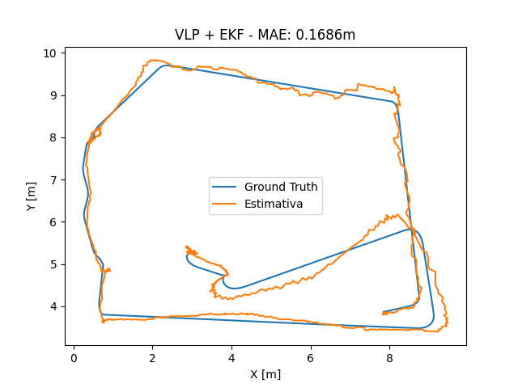

# VLP-EKF Navigation for Pioneer 3-DX

[](http://wiki.ros.org/noetic)
[](https://www.python.org/)
[](http://gazebosim.org/)
[](https://www.radiance-online.org/)
[](LICENSES.md)

Indoor localization and navigation stack for a **Pioneer 3-DX (P3DX)** mobile
robot in ROS Noetic / Gazebo, combining **Visible Light Positioning (VLP)**,
an **ANN-based pose estimator**, **wheel odometry**, **EKF sensor fusion**
(`robot_localization`), and a **Pure Pursuit** path-tracking controller.

---

## Project Status — read this first

This project is composed of independent, individually-validated subsystems.
As of this release, they have **not yet been combined into a single
closed-loop experiment**. Please read this table before the rest of the
README:

| Subsystem | Status | Validated how |
|---|---|---|
| Pure Pursuit controller (P3DX, Gazebo) | ✅ Validated | Closed-loop tracking against **Gazebo ground truth** pose (straight line + closed circuit) |
| VLP physical simulation (Radiance ray-tracing + per-luminaire modulation + FFT demodulation) | ✅ Implemented | Runs online in Gazebo, publishes `/estimated_illuminance` |
| ANN pose estimator (PyTorch MLP, trained weights included) | ✅ Implemented | Runs online, publishes `/ann_pose` |
| EKF fusion (`robot_localization`, wheel-odometry velocity + ANN/VLP position) | ✅ Implemented and measured | Compared against Gazebo ground truth under **manual teleoperation** — see [Experiments](#experiments--results) |
| **Pure Pursuit driven by the fused VLP+EKF pose** (i.e. the full closed loop: VLP → EKF → Pure Pursuit → P3DX) | 🔜 **Not yet done** | This is the next milestone — see [Next Milestone](#next-milestone) |

**In short:** the localization stack (VLP+EKF) and the control stack (Pure
Pursuit) have each been validated on their own, against ground truth, but
**not yet together**. Any claim of "autonomous VLP-based navigation" would be
premature until that integration experiment exists. This README describes
exactly what has been measured, and separately, what is still planned.

---

## System Overview

```text
Visible-light measurements (Radiance ray-tracing, per-luminaire modulation)
          |
          v
   FFT demodulation
          |
          v
   ANN pose estimator (PyTorch MLP)
          |
      /ann_pose
          |
          +-------------------------+
                                     |
Wheel odometry (/RosAria/odom) ------+----> EKF (robot_localization) ----> /odometry/filtered
                                                                                  |
                                                                                  v
                                                                    [NOT YET CONNECTED]
                                                                                  |
                                                                                  v
                                                                           Pure Pursuit
                                                                                  |
                                                                                  v
                                                                            Pioneer 3-DX
```

The dashed link between `/odometry/filtered` and Pure Pursuit is the
integration step described in [Next Milestone](#next-milestone). Today, Pure
Pursuit is validated only against `/base_pose_ground_truth`.

---

## Subsystems

### 1. Visible Light Positioning (`ros_ws/src/vlp`)

`vlp/scripts/vlp.py` simulates the physical VLC channel using
[Radiance](https://www.radiance-online.org/) (`ies2rad`, `oconv`, `rtrace`,
`genbox`, `xform`):

- each of the 12 luminaires is described by a real IES photometric file
  (`estimator/IES_files/LEDtube.ies`) and placed in the room;
- each luminaire is modulated at its own frequency (4.75–46.25 kHz range);
- at every simulation step, `rtrace` computes the instantaneous illuminance
  at the robot's position for each luminaire, the signal is windowed
  (10 ms) and sampled at 100 kHz;
- `estimator/fft.py` applies an FFT and extracts the RMS amplitude at each
  of the 12 modulation frequencies, producing a 12-dimensional feature
  vector (`custom_msg_python/msg/IlluminanceArray`).

### 2. ANN Pose Estimator (`ros_ws/src/vlp/scripts/ann.py`)

A small MLP regressor (PyTorch, `input_dim=12 → hidden=128 → output=2`)
maps the 12-dimensional illuminance feature vector to a planar `(x, y)`
position estimate, published as `/ann_pose`
(`geometry_msgs/PoseWithCovarianceStamped`). Trained weights are included in
`vlp/scripts/models/model_RNA.pickle`.

> **[EVIDENCE NEEDED]** The training procedure, dataset generation script,
> train/validation split, and standalone estimator accuracy (i.e. ANN error
> before EKF fusion) are not yet documented in this repository. Add these
> before citing the ANN's accuracy independently of the fused result below.

### 3. EKF Sensor Fusion (`ros_ws/src/nav`)

Uses the standard ROS `robot_localization` package
(`nav/config/ekf.yaml`), fusing:

- **odometry velocity** (`/RosAria/odom_`: linear x, angular z only);
- **ANN/VLP position** (`/ann_pose`: x, y only).

Output: `/odometry/filtered`, `map → base_link` in a 2D-mode configuration.

### 4. Pure Pursuit Controller (`ros_ws/src/pure_pursuit`)

Independent, previously-validated geometric path-tracking controller. See
[`ros_ws/src/pure_pursuit/README.md`](ros_ws/src/pure_pursuit/README.md) for
the full technical description, interfaces, fail-safe behavior, and its own
experimental results against 
Gazebo ground truth.

### 5. Simulation World (`ros_ws/src/my_worlds`)

Gazebo worlds (`bulb_world.world`, `tube_world.world`) and custom luminaire
models (`ledBulb`, `ledTube`) reproducing the 12-luminaire ceiling layout
used by the VLP simulation (`config/luminaire_positions.json`).

### 6. Robot Description and Base Control (`ros_ws/src/p3dx`)

Pioneer 3-DX URDF, Gazebo spawn, and low-level differential-drive control.
Third-party packages, MIT-licensed, with original attribution preserved
(see [`ros_ws/src/p3dx/README.md`](ros_ws/src/p3dx/README.md)).

### 7. Kinematics Reference Script (`reference/pure_pursuit_reference.py`)

A standalone, offline (no ROS) differential-drive kinematics and Pure
Pursuit reference implementation, used as a mathematical reference during
development. Not part of the runtime system.

---

## Experiments & Results

### A. Pure Pursuit vs. ground truth (controller-only validation)

Full results and methodology in
[`ros_ws/src/pure_pursuit/README.md`](ros_ws/src/pure_pursuit/README.md).
Summary:

| Scenario | Mean tracking error | RMSE | Max error |
|---|---:|---:|---:|
| Straight line (2 m) | 2.36 cm | 2.70 cm | 4.87 cm |
| Closed circuit (~30.75 m) | 3.39 cm | 5.05 cm | 16.58 cm |

Both use `/base_pose_ground_truth` as the pose source — **not** the fused
VLP+EKF estimate.

### B. VLP+EKF localization accuracy vs. ground truth (localization-only validation)

Data: `ros_ws/src/nav/scripts/gt_gazebo.json` / `position.json` (1417
synchronized samples, ~159 s), collected with the robot under **manual
teleoperation** (`teleop_twist_keyboard`), comparing `/odometry/filtered`
(VLP+EKF) against `/base_pose_ground_truth`.

| Metric | Value |
|---|---:|
| Mean Absolute Error (2D) | 0.169 m |
| RMSE (2D) | 0.214 m |
| Max error | 0.725 m |
| Samples | 1417 |
| Duration | ~159 s |



**What this does and does not show:** this validates that the VLP+EKF
pipeline tracks the robot's true position with sub-meter accuracy under
manual driving, drifting less than raw odometry would over the same path.
It does **not** yet show closed-loop autonomous navigation using this
estimate — that is the next milestone.

---

## Next Milestone — Closing the Loop (Experiment C)

Run the Pure Pursuit controller with `/odometry/filtered` (VLP+EKF) as its
`pose_topic`, instead of `/base_pose_ground_truth`, on the same Interlagos
benchmark already validated in Experiment A, so all three experiments are
directly comparable:

| Experiment | Pose used by the controller | Status |
|---|---|---|
| A — Controller-only | Ground truth | ✅ Done |
| B — Localization-only | N/A (VLP+EKF measured under manual teleoperation) | ✅ Done |
| **C — Closed loop** | **VLP+EKF (`/odometry/filtered`)** | 🔜 **This is what remains** |

### What is required to run Experiment C

1. **A combined launch file.** Neither existing launch chains the other:
   `pure_pursuit/launch/simulation_control.launch` starts the controller and
   path publisher but not VLP/EKF; `nav/launch/robot_nav.launch` starts
   VLP/EKF but not the controller. A new launch must include: world + robot
   spawn, `vlp/launch/vlp.launch`, the `ekf_localization_node` (using
   `nav/config/ekf.yaml`), the path publisher, and
   `pure_pursuit/launch/pure_pursuit.launch` with `pose_topic` overridden to
   `/odometry/filtered`.
2. **Verify `frame_id` compatibility before trusting any result.** This is
   the most likely silent failure: if `/odometry/filtered` and
   `/navigation/test_path` don't report the same `frame_id`, the controller
   enters `state="frame_mismatch"` and commands zero velocity with no error
   message. Check with `rostopic echo <topic>/header/frame_id` on both
   before running the full experiment.
3. **Verify whether `robot_localization` needs a TF link.** `ann_pose` is
   already published directly in the `map` frame and the odometry input is
   configured to contribute velocity only, specifically to avoid requiring a
   TF tree — but if `ekf_localization_node` still logs a TF lookup failure,
   add a minimal identity `static_transform_publisher` (`map` → `odom`)
   rather than reworking the architecture.
4. **Adapt the logging/validation script.** `validate_simulation.py` only
   compares against `/base_pose_ground_truth` and assumes Pure Pursuit is
   the sole `cmd_vel` publisher; it does not currently log the fused
   estimate the controller is actually using. Extend it (or adapt
   `nav/scripts/analysis.py`, which already computes MAE/RMSE between two
   pose series) to log ground truth, `/odometry/filtered`, and tracking
   error together.
5. **Run it more than once.** Experiments A and B are each a single run
   (N=1); do not repeat that limitation here. Run the closed loop at least
   3 times and report mean ± standard deviation of tracking error, plus how
   often the run completed without hitting `frame_mismatch` or
   `stale_pose`.

> **[EVIDENCE NEEDED]** Until Experiment C exists, do not describe this
> project as demonstrating "autonomous VLP-based navigation" — the correct,
> currently-supportable claim is "independently validated localization and
> control subsystems for VLP-based indoor navigation."

---

## Repository Structure

```text
vlp-ekf-robot-navigation/
├── LICENSE                     (Apache-2.0, project-wide default)
├── LICENSES.md                 (per-component licensing — see below)
├── reference/
│   └── pure_pursuit_reference.py
└── ros_ws/src/
    ├── custom_msg_python/      # IlluminanceArray.msg
    ├── my_worlds/              # Gazebo worlds + luminaire models
    ├── vlp/                    # Radiance simulation + ANN estimator
    ├── nav/                    # EKF fusion config, VLP+EKF vs GT experiment
    ├── pure_pursuit/           # Controller, tests, own results (MIT)
    └── p3dx/                   # Pioneer 3-DX description/control/gazebo (MIT, third-party)
```

---

## Licensing

This repository combines components under different licenses. See
[`LICENSES.md`](LICENSES.md) for the authoritative breakdown:

- **Apache-2.0** (default): `custom_msg_python`, `my_worlds`, `nav`, `vlp`.
- **MIT**: `pure_pursuit` (own implementation) and `p3dx` (third-party,
  original attribution preserved).

---

## Development Environment

- ROS 1 Noetic, Gazebo Classic, Python 3, catkin;
- [Radiance](https://www.radiance-online.org/) lighting simulation suite
  (`ies2rad`, `oconv`, `rtrace`, `genbox`, `xform` must be on `PATH`);
- PyTorch and SciPy for the ANN estimator and FFT demodulation — pinned in
  [`requirements.txt`](requirements.txt).

> **[EVIDENCE NEEDED]** `requirements.txt` lists the non-ROS Python
> dependencies with versions chosen for Python 3.8/3.10 compatibility, but
> has not yet been exercised end-to-end in this project's own ROS Noetic
> environment. Radiance itself still has no scripted/documented
> installation step here — anyone cloning this repository today must
> install Radiance manually. Confirm both before calling the project fully
> reproducible.

## Build

```bash
cd ros_ws
source /opt/ros/noetic/setup.bash
pip install -r ../requirements.txt --break-system-packages
catkin_make
source devel/setup.bash
```

## Run

Localization stack only (VLP + ANN + EKF):

```bash
roslaunch nav localization.launch
```

Full manual-driving localization experiment (as used in Experiment B):

```bash
roslaunch nav robot_nav.launch
```

Pure Pursuit controller-only validation (as used in Experiment A): see
[`ros_ws/src/pure_pursuit/README.md`](ros_ws/src/pure_pursuit/README.md).

---

## Current Limitations

- Pure Pursuit and VLP+EKF have not been run together in closed loop —
  see [Next Milestone](#next-milestone-closing-the-loop-experiment-c) for
  the exact steps remaining.
- The ANN's standalone accuracy (pre-fusion) and its training procedure are
  not documented in this repository.
- Radiance installation is not scripted; Python dependency versions are
  pinned in `requirements.txt` but not yet confirmed end-to-end in this
  project's ROS Noetic environment.
- The VLP+EKF experiment (B) is a single run under manual teleoperation;
  no repeated trials or statistical variance are reported yet — the same
  should be avoided for Experiment C (see Next Milestone, step 5).
- `pure_pursuit/patches/p3dx_control.patch` is superseded now that `p3dx`
  is vendored with the patch already applied directly — safe to remove
  once confirmed unused elsewhere.
- No physical-hardware validation; everything above is simulation-only.

---

## Author

**Matheus Augusto Franco Silva**
Electrical Engineering — Robotics and Industrial Automation
Universidade Federal de Juiz de Fora (UFJF), Brazil
GitHub: [@matheusfranco01](https://github.com/matheusfranco01)

## References

**Visible Light Positioning (VLP)**

> T.-H. Do and M. Yoo, "An In-Depth Survey of Visible Light Communication
> Based Positioning Systems," *Sensors*, vol. 16, no. 5, p. 678, 2016.
> https://doi.org/10.3390/s16050678

**VLP + EKF sensor fusion** (the specific combination used by this project)

> Z. Li, L. Feng, and A. Yang, "Fusion Based on Visible Light Positioning
> and Inertial Navigation Using Extended Kalman Filters," *Sensors*,
> vol. 17, no. 5, p. 1093, 2017. https://doi.org/10.3390/s17051093

**ANN-based pose estimation from VLP measurements**

> N. Chaudhary, O. I. Younus, L. N. Alves, Z. Ghassemlooy, and
> S. Zvanovec, "The Usage of ANN for Regression Analysis in Visible Light
> Positioning Systems," *Sensors*, vol. 22, no. 8, p. 2879, 2022.
> https://doi.org/10.3390/s22082879

**Extended Kalman Filter (general formulation)**

> G. Welch and G. Bishop, *An Introduction to the Kalman Filter*,
> University of North Carolina at Chapel Hill, TR 95-041, 1995
> (updated 2006).

**`robot_localization` (the ROS package used for EKF fusion in `nav/`)**

> T. Moore and D. Stouch, "A Generalized Extended Kalman Filter
> Implementation for the Robot Operating System," in *Intelligent
> Autonomous Systems 13*, Advances in Intelligent Systems and Computing,
> vol. 302, Springer, 2016 (presented at IAS-13, 2014).

**Pure Pursuit path tracking**

> R. C. Coulter, *Implementation of the Pure Pursuit Path Tracking
> Algorithm*, Carnegie Mellon University, 1992.

> **[EVIDENCE NEEDED]** These are foundational/general references for each
> technique used in the project, not necessarily the exact sources
> consulted during development. If specific papers guided a design choice
> (e.g. the modulation-frequency scheme per luminaire, the ANN
> architecture, or particular EKF tuning choices), add them here
> specifically — a reader evaluating this project for research fit will
> look for that traceability.
