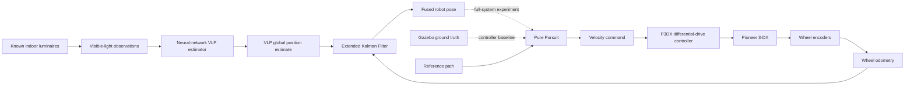
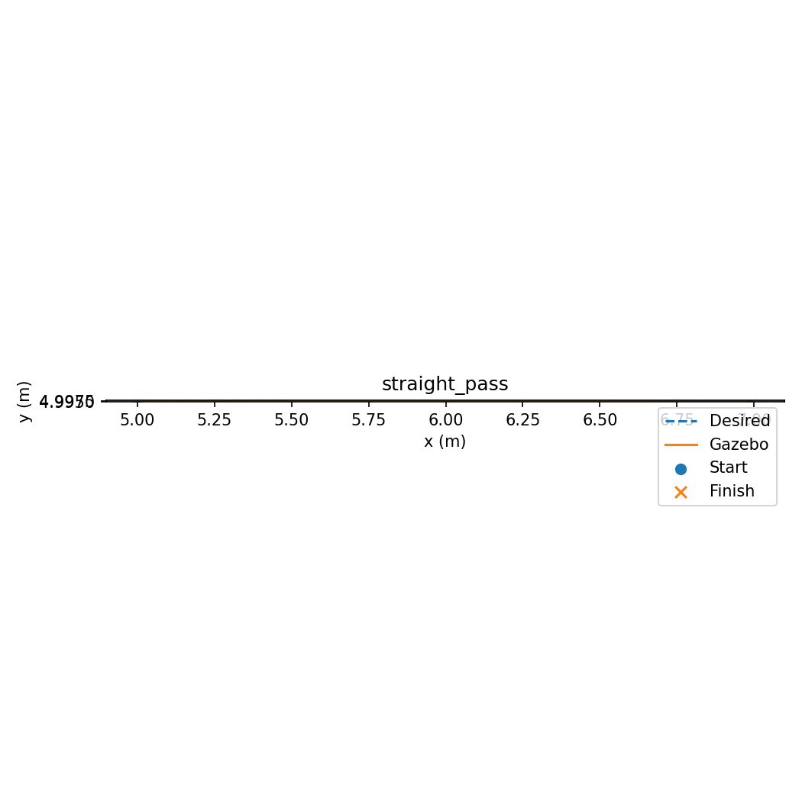
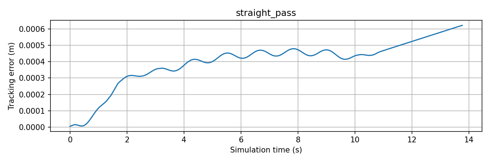
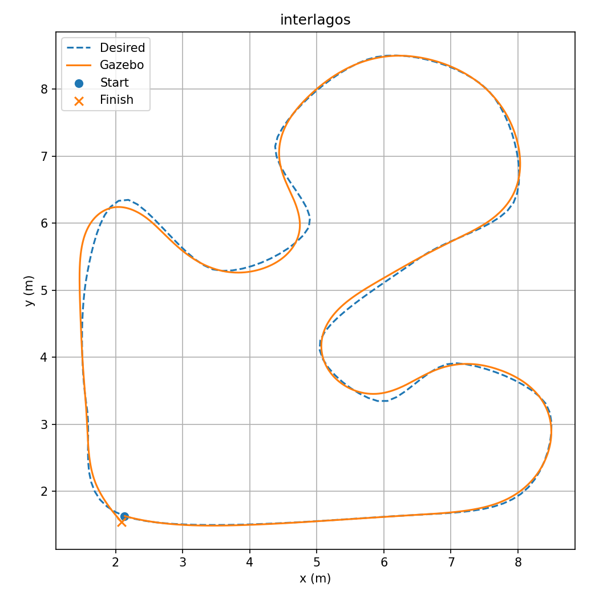
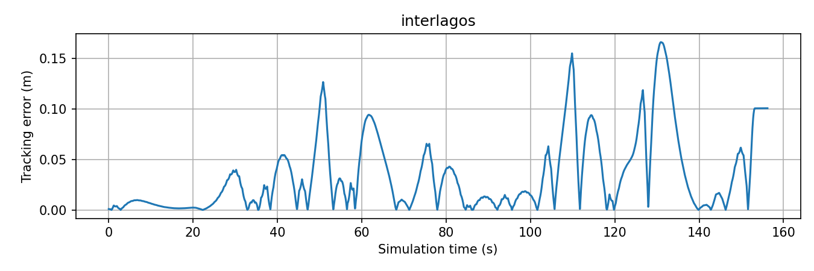

# VLP-EKF Localization and Path Tracking for a Pioneer 3-DX

[](http://wiki.ros.org/noetic)
[](https://www.python.org/)
[](http://gazebosim.org/)
[](https://www.docker.com/)
[](LICENSE)

Indoor mobile-robot localization and path tracking for a **Pioneer 3-DX (P3DX)** using **Visible Light Positioning (VLP)**, a neural-network position estimator, **Extended Kalman Filter (EKF)** sensor fusion, wheel odometry, and a **Pure Pursuit** path-tracking controller in ROS Noetic and Gazebo.

The central problem addressed by this work is a classic limitation of differential-drive mobile robots: **wheel odometry is locally useful but accumulates drift over time**. This project investigates an indoor localization architecture in which visible-light measurements provide an absolute position reference, while wheel odometry provides high-rate relative motion. An EKF fuses both information sources to produce a more robust robot state estimate for navigation.

The Pure Pursuit controller is the motion-control layer used to validate the navigation side of the architecture and to provide a repeatable benchmark for future comparison between ground-truth localization and the fused VLP-EKF estimate.

> **Core idea:** use the indoor lighting infrastructure as an absolute localization reference, estimate position with a neural network, fuse it with wheel odometry through an EKF, and use the resulting state estimate to close the navigation loop of a mobile robot.

---

## Project Overview

The complete research architecture is:

```text
Visible-light measurements
          │
          ▼
   Neural network
          │
          ▼
   VLP position estimate
          │
          ├───────────────┐
          │               │
          │               ▼
          │        Extended Kalman Filter
          │               ▲
          │               │
          │        Wheel odometry
          │
          ▼
     Fused robot pose
          │
          ▼
     Pure Pursuit
          │
          ▼
     Pioneer 3-DX
```

The system is designed to exploit the complementary characteristics of its sensors:

- **wheel odometry** provides fast relative motion information;
- **VLP** provides an absolute position reference tied to the known lighting environment;
- the **neural network** maps the received light signature to a global planar position estimate;
- the **EKF** combines the absolute VLP estimate with odometry;
- **Pure Pursuit** uses the resulting pose estimate for closed-loop path tracking.

---

## Research Motivation

Indoor robots frequently operate in environments where GNSS is unavailable or unreliable.

Wheel encoders are inexpensive and widely used, but dead reckoning accumulates error because of effects such as:

- wheel slip;
- unequal effective wheel radii;
- calibration errors;
- finite encoder resolution;
- unmodeled dynamics;
- integration of small errors over time.

The proposed localization approach introduces an independent source of global information through the lighting infrastructure.

Instead of replacing odometry, the VLP subsystem is intended to **correct accumulated odometric drift**.

---

## Visible Light Positioning

The simulation world contains a known arrangement of elevated luminaires. Their spatial distribution generates a location-dependent illumination signature that can be used for indoor positioning.

The broader VLP pipeline is conceptually:

```text
Known luminaire map
        +
received luminance / light signature
        ↓
feature vector
        ↓
neural network
        ↓
estimated global position
```

The neural-network estimate is then fused with wheel odometry through the EKF.

The use of a learned estimator is particularly useful when the relation between measured illumination and robot position is difficult to model analytically with sufficient robustness.

---

## Neural-Network Localization

The VLP subsystem uses a neural network to estimate planar position from visible-light measurements.

Its role is to provide an **absolute position observation** in the global environment.

The network output is complementary to wheel odometry:

```text
Neural-network VLP estimate
    → absolute position information

Wheel odometry
    → relative motion information
```

The exact network architecture, dataset generation strategy, training procedure, and final localization statistics belong to the VLP subsystem and should be reported together with the final end-to-end localization experiment.

---

## EKF Sensor Fusion

The Extended Kalman Filter combines the information from the VLP estimator and wheel odometry.

The intended high-level ROS flow is:

```text
/RosAria/odom
      │
      ▼
odometry preprocessing / frame alignment
      │
      ▼
wheel-odometry input
      │
      ├──────────────┐
      │              ▼
      │             EKF
      │              ▲
      │              │
      └──── VLP neural-network position estimate
                     │
                     ▼
             fused robot state
                     │
                     ▼
               path controller
```

The key research question is whether the VLP observations can reduce the accumulated drift inherent to wheel odometry while preserving sufficiently smooth and accurate state estimation for motion control.

---

## Why Pure Pursuit Is Part of the Project

A localization system becomes operationally meaningful when the robot uses the estimated state to move.

For that reason, this project includes a complete Pure Pursuit controller and a quantitative Gazebo validation framework.

The controller allows the project to evaluate questions such as:

- Can the robot follow a nontrivial reference path using the available pose estimate?
- How much does tracking error increase when ground truth is replaced by the fused localization estimate?
- Does the fused estimate remain stable through curves and long trajectories?
- Does VLP correction reduce the impact of accumulated odometric drift?

The current Pure Pursuit baseline was intentionally validated first using:

```text
/base_pose_ground_truth
```

This isolates the controller from localization error.

The project therefore follows two experimental stages:

```text
Stage 1 — Controller validation
Gazebo ground truth
        ↓
Pure Pursuit
        ↓
P3DX

Stage 2 — Full-system validation
VLP + wheel odometry
        ↓
EKF
        ↓
fused pose
        ↓
Pure Pursuit
        ↓
P3DX
```

This separation makes it possible to distinguish **controller error** from **localization error**.

---

## System Architecture



---

## Current Repository Scope

This repository currently contains the **validated Pure Pursuit control and experimental-validation module** used by the broader VLP-EKF localization project.

The broader ROS workspace also contains the VLP localization implementation as a separate package.

Keeping these subsystems modular is intentional:

- Pure Pursuit can be validated independently;
- VLP can be evaluated independently;
- EKF integration can then be evaluated without changing the controller mathematics;
- the same trajectory and metrics can be reused for fair comparisons.

The final end-to-end target is:

```text
VLP neural network
      +
wheel odometry
      ↓
EKF
      ↓
fused pose
      ↓
Pure Pursuit
      ↓
P3DX
```

---

## Pure Pursuit Controller

Pure Pursuit is a geometric path-tracking algorithm.

For a look-ahead point expressed in the robot frame, the curvature is

\[
\kappa = \frac{2y_L}{L_d^2}
\]

where:

- \(y_L\) is the lateral coordinate of the look-ahead point;
- \(L_d\) is the look-ahead distance.

For linear velocity \(v\),

\[
\omega = v\kappa
\]

defines the angular velocity command.

The implementation adds the practical behavior required for ROS operation:

- path validation;
- pose validation and timeout;
- quaternion normalization and yaw extraction;
- nearest-path/progress tracking;
- forward-only local search;
- interpolated look-ahead selection;
- angular-velocity saturation;
- monotonic progress on closed paths;
- arrival detection;
- zero command on invalid state;
- explicit stop on completion;
- explicit stop on normal shutdown;
- status reporting and experiment logging.

Validated baseline parameters include approximately:

```text
linear speed        = 0.20 m/s
look-ahead distance = 0.70 m
```

---

## ROS Controller Interfaces

The Pure Pursuit node is isolated by default.

| Interface | Default | Message |
|---|---|---|
| `pose_topic` | `/base_pose_ground_truth` | `nav_msgs/Odometry` |
| `path_topic` | `/navigation/test_path` | `nav_msgs/Path` |
| `cmd_vel_topic` | `/navigation/pure_pursuit_cmd_vel` | `geometry_msgs/Twist` |

The default output therefore does **not** directly command the P3DX.

Only the controlled simulation launch connects the controller output to:

```text
/RosAria/cmd_vel
```

This design reduces the risk of command conflicts and accidental actuation.

---

## Fail-Safe Behavior

The controller commands zero velocity when:

- no valid pose is available;
- the pose becomes stale;
- the path is empty or invalid;
- path and pose frames are incompatible;
- a new path replaces the active one;
- the goal is reached;
- the node shuts down normally.

The pose quaternion is normalized before yaw extraction.

A real robot should still use an actuator-side watchdog; a final ROS message cannot be treated as a hard real-time safety guarantee.

---

## Simulation Environment

The simulated world was inspected before defining the benchmark path.

```text
Floor size:           10 m × 10 m
Nominal bounds:       [0,10] × [0,10] m
Inner wall faces:     approximately 0.02 m and 9.98 m
Ceiling height:       5 m
Number of luminaires: 12
Luminaire height:     approximately 4.8 m
```

The luminaires are elevated and do not obstruct planar robot motion.

Approximate P3DX dimensions considered during path design:

```text
chassis: ~0.43 m × 0.28 m
top:     ~0.445 m × 0.38 m
```

The benchmark trajectory is constrained to the conservative region:

```text
x ∈ [1.5, 8.5] m
y ∈ [1.5, 8.5] m
```

---

## Interlagos-Inspired Benchmark

A closed trajectory inspired by **Autódromo José Carlos Pace (Interlagos)** is used as a demanding path-tracking benchmark.

It is not intended as a geographic reproduction.

The reference contains:

- a relatively long main straight;
- a tighter first corner;
- alternating left/right curvature;
- variable-radius turns;
- a sinuous middle section;
- a second straight;
- a final return to the starting region.

Generation pipeline:

```text
normalized control points
        ↓
periodic Catmull–Rom interpolation
        ↓
scaling into the safe world region
        ↓
arc-length resampling
        ↓
dense closed path
```

| Property | Value |
|---|---:|
| Approx. path length | 30.75 m |
| Number of points | 207 |
| Approx. point spacing | 0.15 m |
| Safe generation region | `[1.5, 8.5]²` m |

---

## Closed-Path Progress Handling

Closed paths require special handling because start and finish are spatially close.

A naive nearest-waypoint method can incorrectly declare completion at the beginning.

The implementation therefore uses monotonic progress:

- forward local projection;
- no regression to previously completed path sections;
- look-ahead interpolation along accumulated arc length;
- completion only after sufficient path progress;
- final distance tolerance near the closing point;
- latched zero velocity after one completed lap.

There is no automatic second lap.

---

# Experimental Results

## Straight-Line Validation

Before the closed-track experiment, the full ROS/Gazebo control chain was validated on a 2 m straight reference.

| Metric | Result |
|---|---:|
| Robot traveled distance | **1.979 m** |
| Final distance to target | **2.1 cm** |
| Maximum commanded linear speed | **0.20 m/s** |
| Stationary validation interval | **3 s** |
| Exclusive controller publisher | **Passed** |





---

## Interlagos-Inspired Closed Track

| Metric | Result |
|---|---:|
| Reference length | ~30.75 m |
| Robot traveled distance | **30.49 m** |
| Mean tracking error | **3.39 cm** |
| Tracking RMSE | **5.05 cm** |
| Maximum tracking error | **16.58 cm** |
| Maximum commanded linear speed | **0.20 m/s** |
| Maximum commanded angular speed | **0.446 rad/s** |
| Progress regression | **None observed** |
| Final stationary check | **Passed** |





After the controller triggered arrival and the simulated platform physically decelerated, the robot remained stopped approximately 10 cm from the initial reference point.

That residual is reported explicitly rather than hidden from the experimental record.

---

## Interpretation of the Current Results

These measurements validate:

```text
Pure Pursuit
+
P3DX controller
+
Gazebo simulation
+
trajectory generation
+
runtime validation
```

under **ground-truth pose feedback**.

They do **not** yet represent the localization accuracy of the complete VLP-EKF system.

The important next experiment is:

```text
Ground-truth pose feedback
             vs.
VLP + EKF pose feedback
```

using:

- the same robot;
- the same path;
- the same controller parameters;
- the same speed;
- the same performance metrics.

This experiment will quantify how well the proposed localization system supports closed-loop navigation.

---

## Validation and Instrumentation

The validation tooling records:

- ROS time;
- measured robot pose;
- nearest projection onto the reference;
- tracking error;
- commanded linear velocity;
- commanded angular velocity;
- path index;
- progress;
- accumulated traveled distance;
- controller state;
- measured robot velocities.

The runtime validator also checks the ROS graph.

During the validated Gazebo experiment:

```text
p3dx_joint_publisher → running
RosAria              → running
```

and Pure Pursuit is verified as the intended velocity-command publisher during the measurement.

---

## Repository Structure

```text
vlp-ekf-p3dx/
├── config/
│   └── pure_pursuit.yaml
├── launch/
│   ├── interlagos_demo.launch
│   ├── pure_pursuit.launch
│   ├── simulation.launch
│   ├── simulation_control.launch
│   └── test_path.launch
├── patches/
│   └── p3dx_control.patch
├── results/
│   ├── interlagos/
│   │   ├── offline_metrics.json
│   │   ├── path.csv
│   │   ├── summary.json
│   │   ├── tracking_error.png
│   │   ├── trajectory.csv
│   │   └── trajectory.png
│   └── straight/
│       ├── offline_metrics.json
│       ├── path.csv
│       ├── summary.json
│       ├── tracking_error.png
│       ├── trajectory.csv
│       └── trajectory.png
├── scripts/
│   ├── plot_results.py
│   ├── publish_interlagos.py
│   ├── publish_test_path.py
│   ├── pure_pursuit_node.py
│   └── validate_simulation.py
├── test/
│   ├── pure_pursuit.test
│   └── test_pure_pursuit.py
├── CMakeLists.txt
├── LICENSE
├── package.xml
└── README.md
```

The VLP localization code is maintained as a separate ROS package in the broader development workspace.

---

## Development Environment

Validated environment:

- ROS 1 Noetic
- Gazebo Classic
- Python 3
- catkin
- Pioneer 3-DX simulation stack
- Docker image `ros:noetic`
- WSL2 with Ubuntu 22.04

Reference workspace mapping:

```text
WSL:
    ~/vlp-ekf-p3dx/ros_ws

Docker:
    /root/ros_ws
```

Both paths refer to the same mounted workspace.

---

## Build

Inside the ROS container:

```bash
docker exec -it ros-noetic bash
cd /root/ros_ws
source /opt/ros/noetic/setup.bash
catkin_make
source devel/setup.bash
```

For isolated package verification:

```bash
source /opt/ros/noetic/setup.bash
cd /root/ros_ws

catkin_make \
  --source src/pure_pursuit \
  --build /tmp/pure_pursuit_build \
  -DCATKIN_DEVEL_PREFIX=/tmp/pure_pursuit_devel

source /tmp/pure_pursuit_devel/setup.bash
```

---

## P3DX Integration Patch

The external P3DX repository is not vendored here.

The validated local integration changes are preserved in:

```text
patches/p3dx_control.patch
```

Check compatibility before applying:

```bash
git -C src/p3dx apply --check ../pure_pursuit/patches/p3dx_control.patch
```

Apply:

```bash
git -C src/p3dx apply ../pure_pursuit/patches/p3dx_control.patch
```

The patch preserves the P3DX-side configuration required by the validated simulation, including the controller-spawner behavior and base-frame adjustment.

Third-party code remains subject to its original license.

---

## Run the Controller Without Robot Actuation

The default controller output is isolated.

```bash
roslaunch pure_pursuit pure_pursuit.launch
```

In another terminal:

```bash
roslaunch pure_pursuit test_path.launch
```

Observe:

```bash
rostopic echo /navigation/pure_pursuit_cmd_vel
```

This mode is useful for inspecting the controller without connecting it to the base actuator topic.

---

## Controlled Gazebo Demonstration

For the closed-track experiment:

```bash
timeout --signal=INT --kill-after=10s 420s \
  roslaunch pure_pursuit interlagos_demo.launch gui:=false
```

In another terminal:

```bash
timeout --signal=INT --kill-after=10s 370s \
  python3 -B /root/ros_ws/src/pure_pursuit/scripts/validate_simulation.py \
  --path-kind interlagos \
  --timeout 350 \
  --output /root/ros_ws/results/interlagos
```

The validator intentionally checks the command-topic graph, so avoid attaching extra subscribers to the final command topic during strict validation.

---

## Plotting Results

```bash
python3 -B \
  /root/ros_ws/src/pure_pursuit/scripts/plot_results.py \
  /root/ros_ws/results/interlagos
```

Representative CSV, JSON, and PNG outputs from validated runs are included in the repository.

---

## RViz

If RViz is available:

```bash
rviz
```

Suggested configuration:

```text
Fixed Frame:
    map

Path:
    /navigation/test_path

Odometry:
    /base_pose_ground_truth
```

---

## Tests

Automated tests cover:

- straight-path behavior;
- curved-path behavior;
- coordinate transformation;
- angular saturation;
- goal arrival;
- empty path handling;
- path replacement;
- stale pose handling;
- invalid numeric data;
- incompatible frames;
- closed-path geometry;
- monotonic progress;
- closed-loop completion;
- latched stop after one lap.

Run:

```bash
rostest pure_pursuit pure_pursuit.test
```

---

## Safety and Command Ownership

Before connecting Pure Pursuit to the base:

```bash
rostopic info /RosAria/cmd_vel
```

During a controlled experiment, there should not be a competing velocity publisher such as:

- `move_base`;
- DWA;
- teleoperation;
- another controller.

---

## Current Limitations

### Localization

The complete VLP + EKF + Pure Pursuit chain still requires final end-to-end evaluation.

Important integration questions include:

- frame consistency between `map`, `odom`, `base_link`, and related frames;
- correct VLP covariance modeling;
- EKF covariance tuning;
- comparison against ground truth;
- behavior during VLP measurement degradation or dropout;
- repeatability across multiple trajectories and starting positions.

### Controller

The current Pure Pursuit baseline:

- does not perform obstacle avoidance;
- does not perform global planning;
- does not reverse;
- does not explicitly regulate final orientation;
- uses conservative constant linear velocity in the validated experiment;
- does not automatically run a second lap.

---

## Next Research Milestone

The next major experiment is:

```text
Visible-light observations
        ↓
Neural network
        ↓
VLP global position
        │
        ├────► EKF ◄──── wheel odometry
        │
        ▼
fused pose
        ↓
Pure Pursuit
        ↓
P3DX
```

Run the same closed trajectory and compare against the ground-truth baseline using:

- VLP position error;
- fused-pose error;
- path-tracking mean error;
- RMSE;
- maximum error;
- final-position error;
- lap completion;
- robustness over repeated trials.

---

## Future Work

- complete end-to-end VLP + EKF + Pure Pursuit validation;
- quantify wheel-odometry drift with and without VLP correction;
- evaluate VLP error across the full map;
- document and evaluate the neural-network architecture and dataset;
- analyze sensitivity to illumination noise;
- tune EKF covariances experimentally;
- evaluate measurement dropout and recovery;
- compare multiple look-ahead strategies;
- add curvature-adaptive velocity control;
- perform repeated-run statistics;
- compare against alternative localization approaches;
- validate the architecture on physical hardware.

---

## Experimental Methodology

The project follows incremental validation:

```text
1. Validate Gazebo and P3DX.
2. Validate the base controller.
3. Validate direct velocity commands.
4. Validate Pure Pursuit on a straight path.
5. Validate Pure Pursuit on a complex closed path.
6. Quantify controller error with ground truth.
7. Validate neural-network VLP localization.
8. Validate EKF fusion against ground truth.
9. Replace ground truth with fused localization.
10. Measure the complete system end to end.
```

This ordering avoids mixing localization, control, TF, timing, and actuation errors in a single experiment.

---

## Reproducibility

The repository preserves:

- controller source code;
- launch files;
- controller configuration;
- ROS tests;
- P3DX integration patch;
- reference paths;
- trajectory CSV files;
- validation summaries;
- tracking plots.

For strict scientific reproduction, future releases should also record the exact revisions of the VLP and P3DX dependencies used in each experiment.

---

## License

This repository is released under the [MIT License](LICENSE).

External ROS, Gazebo, P3DX, VLP dependencies, and other third-party components remain subject to their respective licenses.

---

## Author

**Matheus Augusto Franco Silva**

Electrical Engineering — Robotics and Industrial Automation  
Universidade Federal de Juiz de Fora (UFJF), Brazil

GitHub: [@matheusfranco01](https://github.com/matheusfranco01)

Areas represented in this project include:

- autonomous mobile robotics;
- indoor localization;
- Visible Light Positioning;
- neural networks;
- Extended Kalman Filtering;
- sensor fusion;
- differential-drive control;
- path tracking;
- ROS-based robotic systems.

---

## Reference

A foundational Pure Pursuit reference is:

> R. Craig Coulter, *Implementation of the Pure Pursuit Path Tracking Algorithm*, Carnegie Mellon University, 1992.

The final academic version of this repository should also include the VLP, neural-network localization, and EKF references used in the associated thesis/report.

---

## Project Status

| Subsystem | Status |
|---|---|
| P3DX Gazebo simulation | ✅ Validated |
| Differential-drive controller | ✅ Validated |
| Pure Pursuit — straight path | ✅ Validated |
| Pure Pursuit — closed benchmark | ✅ Validated |
| Runtime validation and logging | ✅ Validated |
| VLP neural-network localization | 🧪 Developed in broader workspace / under evaluation |
| VLP + wheel-odometry EKF fusion | 🧪 Integration/evaluation stage |
| Pure Pursuit with fused VLP-EKF pose | 🔜 Next major experiment |
| Physical P3DX validation | 🔜 Future work |

---

### Project in one sentence

> **A mobile-robot localization and navigation architecture that uses visible light as an absolute position reference, neural-network inference for VLP, EKF fusion with wheel odometry, and Pure Pursuit for closed-loop path tracking.**
